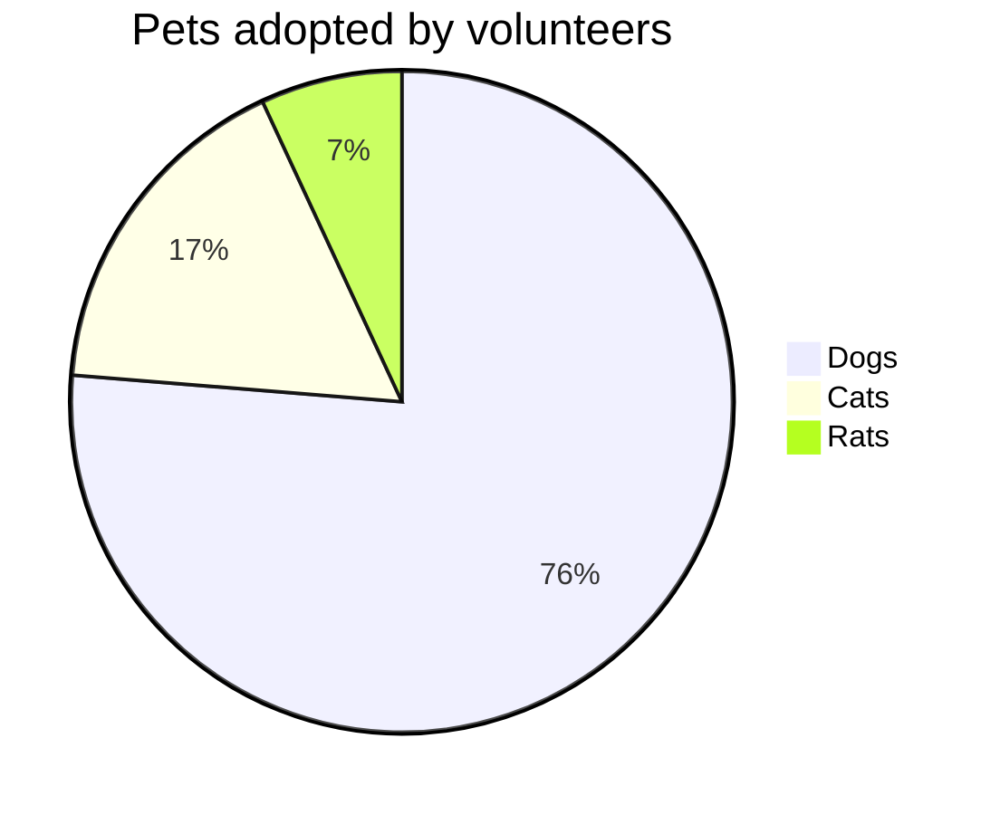

# 시험 정보

이름 : GAIQ
100점 만점
자격증은 다운로드 하는 거임
이력서에 추가하면 댐

100점 만점 80점 이상 받으면 합격
70문제
시간 90분
전부 이론 문제
객관식
오픈북
시험비 무료
순서대로 문제를 풀어야 함
**70문제 모두 풀고 제출해야 함**

# 장점
분석 가능
인공지능 도움 받을 수 있음

| :        Fruits \|\| Food       : |||
| :--------- | :-------- | :--------  |
| Apple      | : Apple : | Apple      \
| Banana     |   Banana  | Banana     \
| Orange     |   Orange  | Orange     |
| :   Rowspan is 4    : || How's it?  |
|^^    A. Peach         ||   1. Fine :|
|^^    B. Orange        ||^^ 2. Bad   |
|^^    C. Banana        ||  It's OK!  |

| :                   MathJax \|\| Image                 : |||
| :------------ | :-------- | :----------------------------- |
| Apple         | : Apple : | Apple                          \
| Banana        | Banana    | Banana                         \
| Orange        | Orange    | Orange                         |
| :     Rowspan is 4     : || :        How's it?           : |
| ^^     A. Peach          ||    1. ![example][cell-image]   |
| ^^     B. Orange         || ^^ 2. $I = \int \rho R^{2} dV$ |
| ^^     C. Banana         || **It's OK!**                   |

@startuml
Bob -> Alice : hello
@enduml

